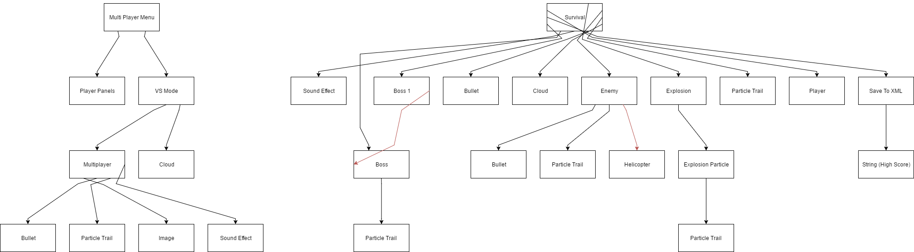
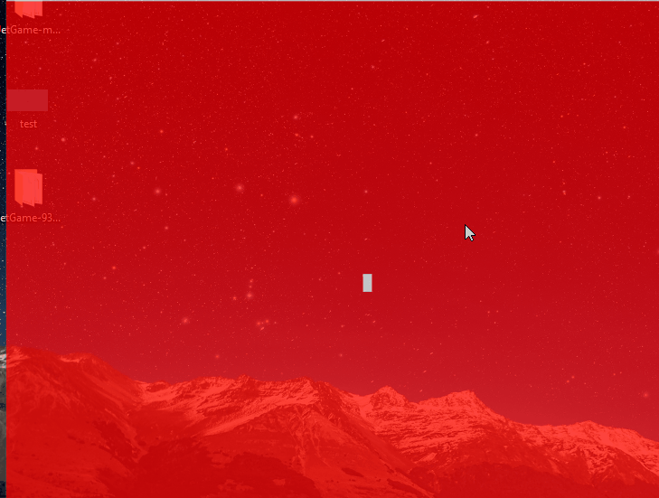
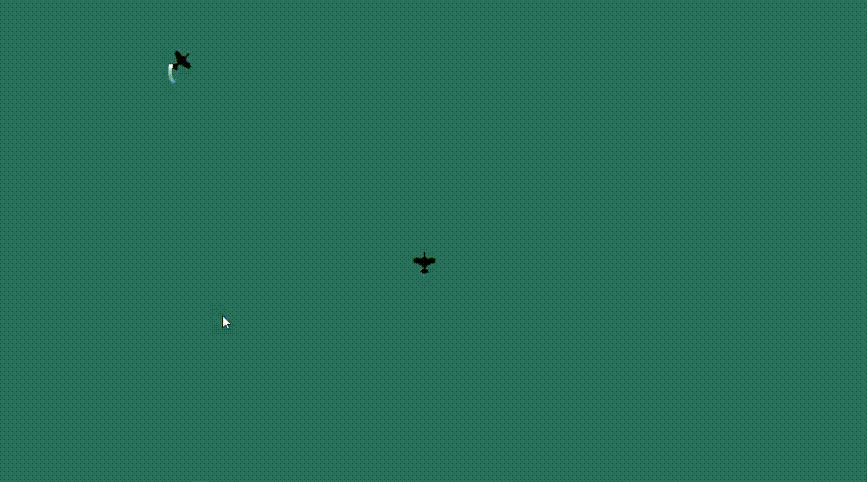
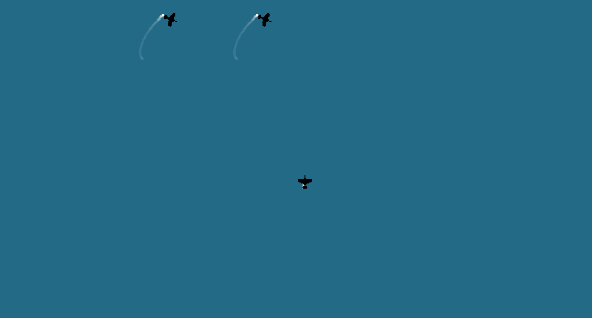

# JetGame
## I Started Playing with Physics for a flying game.
---

# [Download JAR Here!](https://github.com/gkgkgkgk/JetGame/blob/master/main.jar?raw=true "Download JAR Here!")

### Basic chart of how it works:

### GIF Every 20 Updates:

Commit #1

Commit #20

Commit #40

